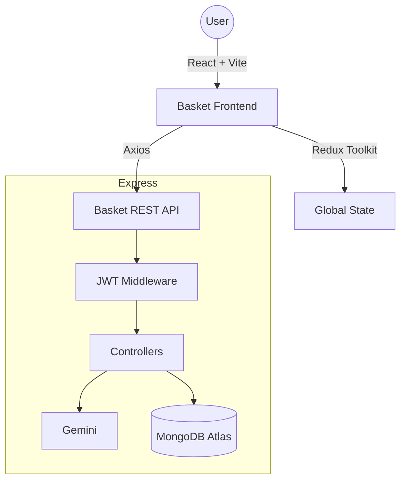

# Basket Store — Premium MERN E-Commerce Platform

A full-stack MERN (MongoDB, Express, React, Node.js) e-commerce app with dark-mode UI, seller/customer role switching, and Google Gemini–powered chat and product insights.

---

## Live demo

| | URL |
|---|-----|
| **Frontend (Vercel)** | `https://YOUR-PROJECT.vercel.app` — replace with your Vercel production URL after you deploy. |
| **Backend API (Render)** | `https://YOUR-SERVICE.onrender.com` — replace with your Render web service URL. |

**Health check:** `GET https://YOUR-SERVICE.onrender.com/api/health`

---

## Repository structure

```
ME5 Ecommerce-backend 2.0/
├── README.md
├── render.yaml                 # Optional Render Blueprint (monorepo → backend folder)
├── ecommerce-backend/
│   ├── index.js                # Express app, CORS, routes
│   ├── seeder.js               # Seed sample products
│   ├── package.json
│   ├── .env.example            # Copy to .env locally (never commit .env)
│   ├── config/
│   │   └── dbConnection.js
│   ├── controllers/            # auth, users, products, orders, admin, AI
│   ├── middleware/
│   ├── models/
│   └── routes/
└── ecommerce-frontend/
    ├── index.html
    ├── vite.config.js
    ├── vercel.json             # SPA fallback for React Router
    ├── package.json
    ├── .env.example
    └── src/
        ├── main.jsx
        ├── App.jsx
        ├── api/
        │   └── axiosInstance.js
        ├── components/         # Navbar, Footer, Chatbot, ProductCard, etc.
        ├── constants/
        ├── pages/
        ├── redux/
        └── index.css
```

---

## Credits

**Developed by:** [Ashfaaq Feroz Muhammad](https://github.com/ashfaaqkt)  
**Context:** Entri Elevate — MERN ME5 assessment (2026)

---

## Key features

### Role switching (customer ↔ seller)

- Toggle role from profile; seller gets access to **Sale Board**.
- Switching seller → customer clears that user’s listed products and orders (by design).

### Google Gemini AI

- Basket AI chat (`/api/ai/chat`) and product analysis (`/api/ai/analyze-product`) with model fallbacks.

### UI

- Tailwind CSS v4, glass-style layout, responsive layout, theme toggle.

### Seller tools

- Sale Board for listings and order status updates.

---

## Technology stack

| Layer | Stack |
|-------|--------|
| Frontend | React 19, Redux Toolkit, Tailwind CSS v4, React Router 7, Vite |
| Backend | Node.js, Express 5, MongoDB / Mongoose, JWT |
| AI | Google Generative AI (Gemini) |

---

## Architecture



---

## Local development

### Backend

```bash
cd ecommerce-backend
npm install
cp .env.example .env
# Edit .env: MONGO_URI, JWT_SECRET, GEMINI_API_KEY, FRONTEND_URL
npm run seed    # optional: seed products
npm run dev     # nodemon
```

Server defaults to port **5002** if `PORT` is unset.

### Frontend

```bash
cd ecommerce-frontend
npm install
cp .env.example .env
# Set VITE_API_URL=http://127.0.0.1:5002/api
npm run dev
```

---

## Deployment (Render backend + Vercel frontend)

### Prerequisites

1. Code pushed to **GitHub**.
2. **MongoDB Atlas** cluster + database user + IP allowlist (or `0.0.0.0/0` for cloud hosts).
3. **Google AI Studio** API key for Gemini (`GEMINI_API_KEY`).
4. Strong random **`JWT_SECRET`** for production.

### A. Backend on Render

1. Open [Render](https://render.com) → sign in → **New** → **Web Service**.
2. Connect the GitHub repo that contains this project.
3. Configure:
   - **Root Directory:** `ecommerce-backend`
   - **Runtime:** Node
   - **Build Command:** `npm install`
   - **Start Command:** `npm start` (runs `node index.js`)
   - **Instance type:** Free tier is fine for demos (cold starts apply).
4. **Environment** (Render dashboard → Environment):
   - `MONGO_URI` — Atlas connection string
   - `JWT_SECRET` — long random string
   - `GEMINI_API_KEY` — Gemini key
   - `FRONTEND_URL` — your **Vercel** production URL (e.g. `https://my-app.vercel.app`).  
     For preview deploys, use a comma-separated list:  
     `https://my-app.vercel.app,https://my-app-git-branch-user.vercel.app`
   - `NODE_VERSION` — e.g. `20` (optional; helps consistency)
5. Deploy and wait until the service is **Live**. Copy the URL, e.g. `https://basket-api-xxxx.onrender.com`.
6. Optional: visit `https://YOUR-SERVICE.onrender.com/api/health` — should return JSON success.

**Seed data on Render:** run `node seeder.js` locally against production `MONGO_URI`, or add a one-off script / Shell in Render (avoid exposing admin routes in production without protection).

### B. Frontend on Vercel

1. Open [Vercel](https://vercel.com) → **Add New** → **Project** → import the same GitHub repo.
2. Configure:
   - **Framework Preset:** Vite
   - **Root Directory:** `ecommerce-frontend`
3. **Environment Variables:**
   - `VITE_API_URL` = `https://YOUR-SERVICE.onrender.com/api` (no trailing slash after `api`)
4. Deploy. Copy the production URL (e.g. `https://my-app.vercel.app`).
5. Go back to **Render** → update `FRONTEND_URL` to that exact Vercel URL → **Manual Deploy** if needed so CORS allows your frontend.

### C. After both are live

1. Update the **Live demo** table at the top of this README with your real Vercel and Render URLs.
2. Confirm login, product listing, cart, and AI features against production.

---

## Environment variables (summary)

**Render (`ecommerce-backend`):**

| Variable | Purpose |
|----------|---------|
| `MONGO_URI` | MongoDB connection string |
| `JWT_SECRET` | JWT signing secret |
| `GEMINI_API_KEY` | Google Gemini API key |
| `FRONTEND_URL` | Vercel origin(s), comma-separated if multiple |
| `PORT` | Set automatically on Render; optional locally |

**Vercel (`ecommerce-frontend`):**

| Variable | Purpose |
|----------|---------|
| `VITE_API_URL` | Public API base, must end with `/api` |

---

## License

Educational / assessment use. Entri Elevate — MERN ME5.
