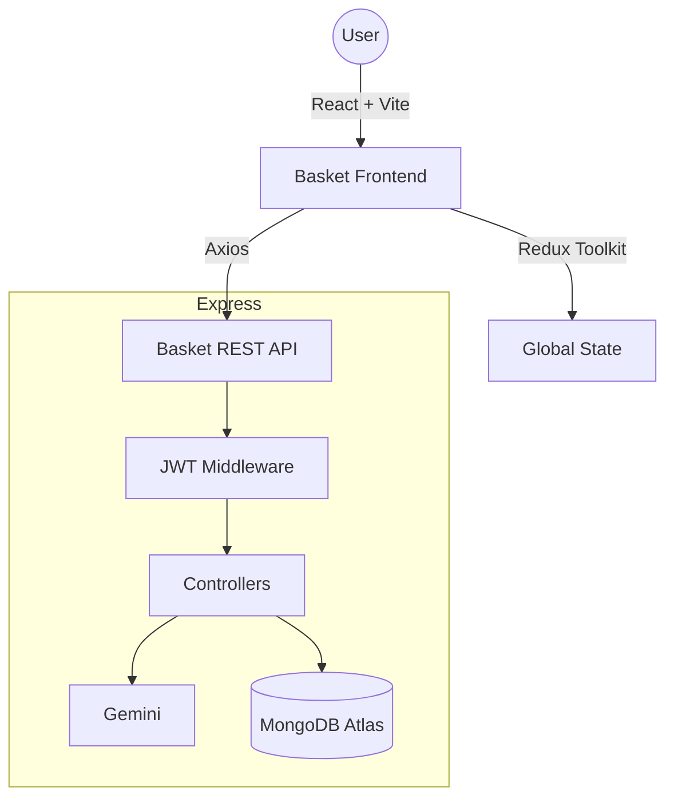

# Basket Store — Premium MERN E-Commerce Platform

A full-stack MERN (MongoDB, Express, React, Node.js) e-commerce app with dark-mode UI, seller/customer role switching, and Google Gemini–powered chat and product insights.

---

## Live demo

| | URL |
|---|-----|
| **Frontend (Vercel)** | `https://YOUR-PROJECT.vercel.app` |
| **Backend API (Render)** | `https://YOUR-SERVICE.onrender.com` |

**Health check:** `GET https://YOUR-SERVICE.onrender.com/api/health`

---

## Repository structure

```
ME5 Ecommerce-backend 2.0/
├── README.md
├── render.yaml                 # Optional Render Blueprint (monorepo → backend folder)
├── ecommerce-backend/
│   ├── index.js                # Express app, CORS, routes
│   ├── seeder.js               # Seed sample products
│   ├── package.json
│   ├── .env.example            # Copy to .env locally (never commit .env)
│   ├── config/
│   │   └── dbConnection.js
│   ├── controllers/            # auth, users, products, orders, admin, AI
│   ├── middleware/
│   ├── models/
│   └── routes/
└── ecommerce-frontend/
    ├── index.html
    ├── vite.config.js
    ├── vercel.json             # SPA fallback for React Router
    ├── package.json
    ├── .env.example
    └── src/
        ├── main.jsx
        ├── App.jsx
        ├── api/
        │   └── axiosInstance.js
        ├── components/         # Navbar, Footer, Chatbot, ProductCard, etc.
        ├── constants/
        ├── pages/
        ├── redux/
        └── index.css
```

---

## Credits

**Developed by:** [Ashfaaq Feroz Muhammad](https://github.com/ashfaaqkt)  
**Context:** Entri Elevate — MERN ME5 assessment (2026)

---

## Key features

### Role switching (customer ↔ seller)

- Toggle role from profile; seller gets access to **Sale Board**.
- Switching seller → customer clears that user’s listed products and orders (by design).

### Google Gemini AI

- Basket AI chat (`/api/ai/chat`) and product analysis (`/api/ai/analyze-product`) with model fallbacks.

### UI

- Tailwind CSS v4, glass-style layout, responsive layout, theme toggle.

### Seller tools

- Sale Board for listings and order status updates.

---

## Technology stack

| Layer | Stack |
|-------|--------|
| Frontend | React 19, Redux Toolkit, Tailwind CSS v4, React Router 7, Vite |
| Backend | Node.js, Express 5, MongoDB / Mongoose, JWT |
| AI | Google Generative AI (Gemini) |

---

## Architecture



---

## Local development

### Backend

```bash
cd ecommerce-backend
npm install
cp .env.example .env
# Edit .env: MONGO_URI, JWT_SECRET, GEMINI_API_KEY, FRONTEND_URL
npm run seed    # optional: seed products
npm run dev     # nodemon
```

Server defaults to port **5002** if `PORT` is unset.

### Frontend

```bash
cd ecommerce-frontend
npm install
cp .env.example .env
# Set VITE_API_URL=http://127.0.0.1:5002/api
npm run dev
```

---

## License

Educational / assessment use. Entri Elevate — MERN ME5.
