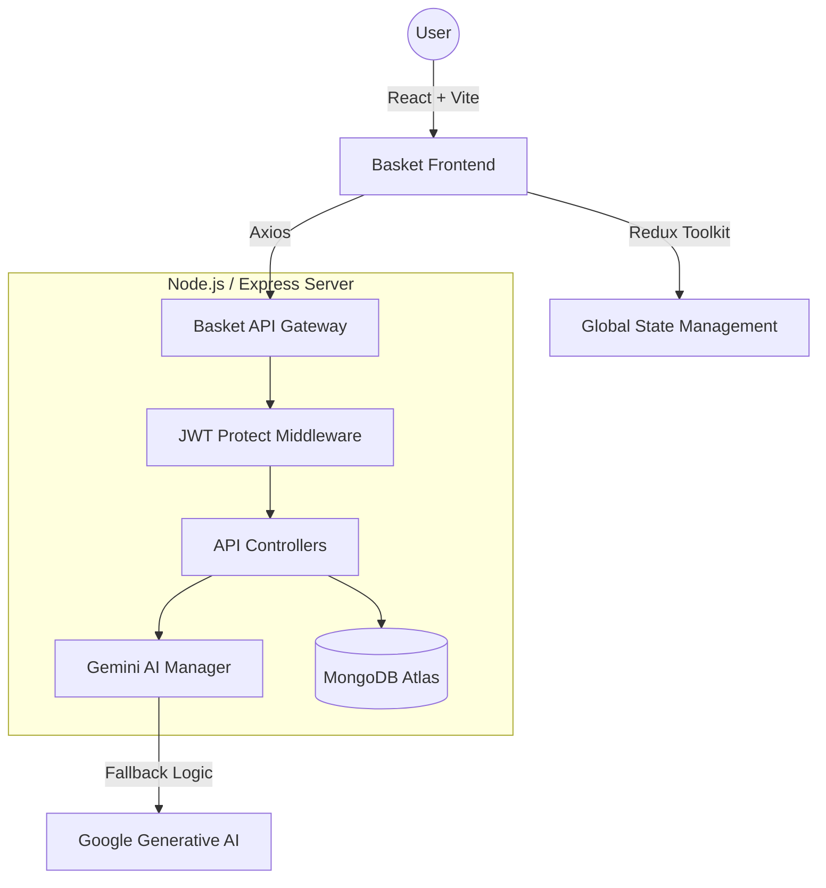

# 🧺 Basket Store — Premium MERN E-Commerce Platform

A sophisticated, end-to-end MERN (MongoDB, Express, React, Node.js) E-Commerce platform featuring a high-end dark-mode-first design, robust role-switching capabilities, and integrated Google Gemini AI.

---

## 🌐 Live Demo & Deployment
*   **Frontend**: Hosted on [Vercel](https://vercel.com/)
*   **Backend**: Hosted on [Render](https://render.com/)
*   *Live URLs coming soon!*

---

## 👨‍💻 Credits
**Developed By:** [Ashfaaq Feroz Muhammad](https://github.com/ashfaaqkt)  
**Project:** Entri Elevate - MERN ME5 Assessment (2026)  
*ME5 is a credit reference to Module 5 End Project.*

---

## ✨ Key Features

### 🔄 Dynamic Role-Switching (Customer ↔ Seller)
- **Fluid Transitions**: Users can switch between Customer and Seller roles instantly from their profile.
- **Automated Cleanup**: Switching from Seller to Customer automatically clears associated product listings and order history to maintain account integrity.
- **Instant Permissions**: Real-time permission updates grant immediate access to the **Sale Board** upon becoming a seller.

### 🤖 Google Gemini AI Ecosystem
- **Intelligent Assistant**: A persistent, theme-aware shopping assistant trained on store policies and product details.
- **AI Sparkle Insights**: Generates 5-sentence expert analyses and value propositions for any product with a single click.
- **High-Availability Fallback**: A robust backend mechanism that cycles through multiple Gemini models and SDK/REST fallbacks to ensure 0% downtime.

### 💎 Premium Glassmorphism UI
- **Tailwind CSS v4**: Built with the latest styling engine for maximum performance and modern aesthetics.
- **Dark Mode First**: A professional, high-contrast aesthetic with smooth gradients, backdrop blurs, and interactive hover states.
- **Mobile Responsive**: Floating rounded components that adapt seamlessly to any device.

### 📊 Professional Sale Board
- **Seller Analytics**: Real-time tracking of total earnings and order volume.
- **Order Management**: Comprehensive lifecycle tracking from "Pending" to "Delivered" with status-aware UI badges.

---

## 🛠️ Technology Stack

| Layer | Technologies |
|--- |--- |
| **Frontend** | React 19, Redux Toolkit, Tailwind CSS v4, React Router 7 |
| **Backend** | Node.js, Express 5, MongoDB, Mongoose 8, JWT |
| **AI Engine** | Google Generative AI (Gemini 2.0 Flash / 1.5 Pro) |
| **Design** | Lucide & React Icons, Google Fonts (Inter/Outfit) |

---

## 🏗️ Technical Architecture



---

## 🚀 Local Development

### 1. Backend Setup
1. Navigate to the backend folder:
   ```bash
   cd ecommerce-backend
   ```
2. Install dependencies:
   ```bash
   npm install
   ```
3. Create a `.env` file (see `.env.example`) and add your credentials.
4. Seed initial products:
   ```bash
   node seeder.js
   ```
5. Start the server:
   ```bash
   npm run dev
   ```

### 2. Frontend Setup
1. Navigate to the frontend folder:
   ```bash
   cd ecommerce-frontend
   ```
2. Install dependencies:
   ```bash
   npm install
   ```
3. Create a `.env` file and add `VITE_API_URL=http://localhost:5002/api`.
4. Start the application:
   ```bash
   npm run dev
   ```

---

## 📄 License
Practice and Education Purpose Only. Developed for Entri Elevate - MERN - ME5 Assessment.
🎬🎨
